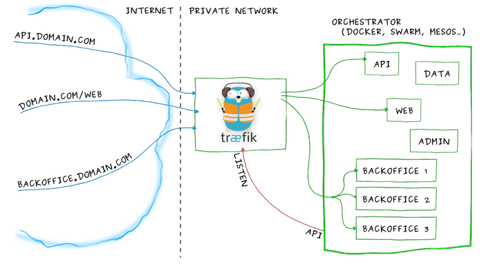

# Traefik

> Træfik (pronounced like traffic) is a modern HTTP reverse proxy and load balancer made to deploy microservices with ease. It supports several backends (Docker, Swarm mode, Kubernetes, Marathon, Consul, Etcd, Rancher, Amazon ECS, and a lot more) to manage its configuration automatically and dynamically.

Contrairement à HAProxy ou Nginx ce reverse proxy peut mettre à jour à chaud sa configuration pour refléter la topologie changeante du cluster.

En bonus, Traefik peut aussi gérer la création/renouvellement d'un certificat SSL (Let's Encrypt). Support Healthcheck et support métriques Prométheus.

Tuto :
https://www.katacoda.com/courses/traefik/deploy-load-balancer

http://training.play-with-docker.com/traefik-load-balancing/
